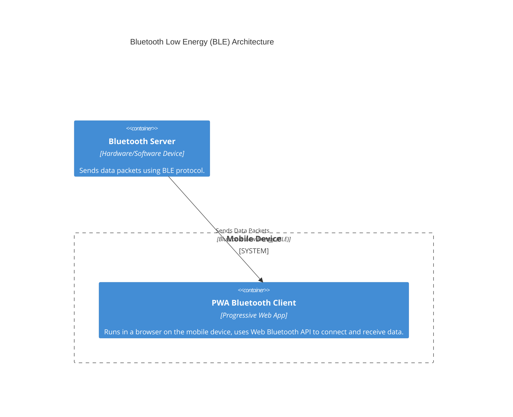

# pwa_ble_client_time_series_data

A HTML, CSS and JS Progressive Web App (PWA) as a Bluetooth Low Energy (BLE) Client for Time Series Data.

## Introduction

This repository is an example project to implement a PWA as a BLE client. The client reads time series data from a BLE server.

We implement the PWA client using HTML, CSS and JS. No build step is required to deploy the code in the [src](./src) directory. We use [deno] to testing, static analysis and documentation purposes.

## Getting Started

You need to install the following requirements:

- A browser compatible with PWAs (I use Chrome)
- [deno]
- [Docker] (with [Docker Compose])

> [!NOTE]
> In Chrome you may need to active the `Experimental Web Platform Features` flag to enable bluetooth (see [How to Enable Experimental Web Platform Features in Chrome Browser]).

As an example we deploy the code from the [src](./src) directory to a [nginx] service in a [Docker Compose] environment. You can start the [Docker Compose] with the following command:

```bash
docker compose up
```

Further details on the deployment can be found in the [Deployment](#deployment) section.

## Documentation

The following diagram illustrates the architecture.



The system consists of two primary components:

Bluetooth Client (PWA): This client is implemented as a Progressive Web App (PWA). PWAs are web applications that can offer an app-like experience, including offline capabilities and access to certain device features when running in a compatible browser. In this architecture, the PWA runs within a web browser on a mobile device (e.g., smartphone or tablet). It leverages the Web Bluetooth API (or similar browser-level Bluetooth access) to interact with BLE devices.

Bluetooth Server: This is a separate hardware device or software running on a device that acts as a BLE peripheral. It's responsible for broadcasting data packets to the BLE client.

Communication Flow
The communication between the client and server is primarily one-way, from the server to the client, utilizing the Bluetooth Low Energy (BLE) protocol.

BLE Protocol: Both the client and server communicate using Bluetooth Low Energy (BLE), which is designed for low power consumption and is ideal for small, periodic data transfers.

Packet Transmission: The Bluetooth server continuously sends data packets.

Client Reception: The PWA client, running on the mobile device, scans for and connects to the Bluetooth server. Once connected, it receives the incoming data packets.

Unidirectional Data Flow: Aside from the initial BLE connection establishment and protocol-level acknowledgements, the application-level data flow is from the server to the client. The client does not send application-specific data back to the server.

This architecture is suitable for scenarios where a mobile application needs to passively receive sensor data, notifications, or other information from a BLE-enabled device.

### Architecture Decisions

#### ADR 1 - Plain HTML, CSS and JS to implement PWA

I implement the PWA in plain HTML, CSS and JS. The files can be served as static (file) resources.

**Advantages:**

- Static files can be served platform indipendent
- Standard web technologies are quite sustainable
- I don't have to learn a fancy framework

**Disadvantages:**

- No fancy server side features
- Tooling is not as nice for JS development

I have the following considerations for the JS development:

I want to have good static analysis, testing and documentation capabilities. For this purpose I use [deno] to implement [testing](#testing) and [linting](#linting). But [deno] is not a browser environment. This means that the access to some global variables (especially the DOM) is not possible. Because of this I keep the following in mind for JS development:

- I use the [app.js](./src/app.js) file access to the DOM
- I don't write test with [deno] for the [app.js](./src/app.js) file
- I write util files that can be tested with [deno] (see [utils.js](./src/utils.js))
- I have to import the util files via script tags in the [index.html](./src/index.html) (before the [app.js](./src/app.js) script tag)

#### ADR 2 - Plain HTML, CSS and JS to implement PWA

I wont implement a build step to create the static files (HTML, CSS, JS, PNG, JSON) that are served as the PWA. This goes in line with [ADR 1](#adr-1---plain-html-css-and-js-to-implement-pwa).

**Advantages:**

- No added complexity via build step
- Files are always human readable

**Disadvantages:**

- Files can't be minimized
- No advantages from frameworks (like imports in JS files)
- File paths for PWA cache through service worker have to be updated manually in [sw.js](./src/sw.js)

#### ADR 3 - "Network First, then Cache Fallback" Caching Strategy for Service Worker

We implement a "Network First, then Cache Fallback" caching strategy for the service worker.

**Advantages:**

- Always latest files automatically (when online)
- Works Offline

**Disadvantages:**

- Might feel a bit slower first time (when online) - not instant
- Uses more data (compared to others)
- Adds complexity to code

## Development

### Preview

During development (in VSCode) you can use the `Live Server` extension (see extension recommendations) to open a live preview of the PWA. Right click on the [index.html](./src/index.html) file and select `Open with Live Server` to open a preview in your browser. This preview will automatically reload if changes are detected.

### Testing

You can use the [Deno CLI Test Command] to execute the tests:

```bash
deno test
# Also run documentation tests
deno test --doc
```

Refer to the documentation for more details on [Deno Documentation Tests].

### Linting

You can use the [Deno CLI Lint Command] to execute the static analysis:

```bash
deno lint
```

## Deployment

### Deployment using Docker Compose

You can deploy the code from the [src](./src) directory to a [nginx] service in a [Docker Compose] environment. You can start the [Docker Compose] with the following command:

```bash
docker compose up
# Open http://localhost in a incognito tab
```

This deployment uses a read-only volume mount to the source directory to get the source files.

## Sources

- [deno]
- [Docker]
- [Docker Compose]
- [nginx]
- [How to Enable Experimental Web Platform Features in Chrome Browser]
- [Deno CLI Test Command]
- [Deno Documentation Tests]
- [Deno CLI Lint Command]

[deno]: https://deno.com/
[Docker]: https://www.docker.com/
[Docker Compose]: https://docs.docker.com/compose/
[nginx]: https://nginx.org/en/
[How to Enable Experimental Web Platform Features in Chrome Browser]: https://techviral.net/enable-experimental-web-platform-features-in-chrome/
[Deno CLI Test Command]: https://docs.deno.com/runtime/reference/cli/test/
[Deno Documentation Tests]: https://docs.deno.com/runtime/reference/documentation/
[Deno CLI Lint Command]: https://docs.deno.com/runtime/reference/cli/lint/